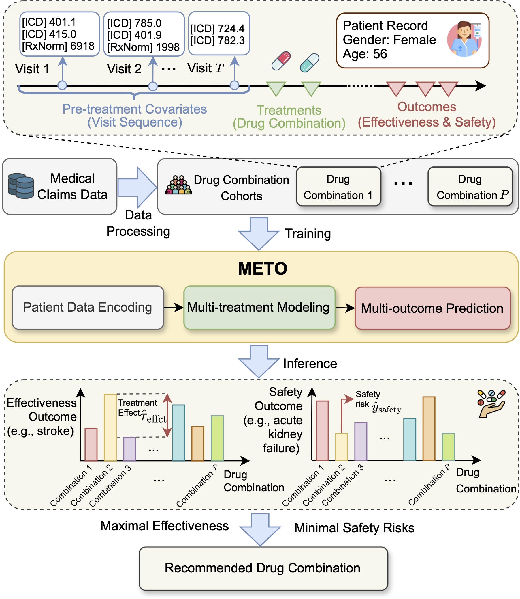

# Estimating the Treatment Effects of Multiple Drug Combinations on Multiple Outcomes in Hypertension
Code for paper "Estimating the Treatment Effects of Multiple Drug Combinations on Multiple Outcomes in Hypertension"

## Introduction
Hypertension poses a significant global health challenge, and its management is often complicated by the complexity of treatment strategies involving multiple drug combinations and the need to consider multiple outcomes. Traditional treatment effect estimation (TEE) methods struggle to address this complexity, as they typically focus on binary treatments and single outcomes. To overcome these limitations, we introduce METO, a novel framework designed for TEE in the context of multiple drug combinations and multiple outcomes. METO employs a multi-treatment encoding mechanism to effectively handle various drug combinations and their sequences, and differentiates between effectiveness and safety outcomes by explicitly learning the outcome type when predicting the treatment outcomes. Furthermore, to address confounding bias in outcome prediction, we employ an inverse probability weighting method tailored for multiple treatments, assigning each patient a balance weight derived from their propensity score against different drug combinations. Our comprehensive evaluation using a real-world patient dataset demonstrates that METO outperforms existing TEE methods, with an average improvement of 5.0\% in area under the precision-recall curve and 6.4\% in influence function-based precision of estimating heterogeneous effects. A case study demonstrates the effectiveness of our method in comprehensive treatment effect assessment, showcasing its potential for personalized treatment recommendations and informed hypertension management.



## Dataset
The data we use is from MarketScan Commercial Claims and Encounters (CCAE) and includes approximately 130 million patients from 2012 to 2021. Access to the MarketScan data analyzed in this manuscript is provided by the Ohio State University. The dataset is available at https://www.merative.com/real-world-evidence.

### Data structures
#### Cohort

| Column | Description                        | Note                                                                                                                                 |
|-------------|------------------------------------|--------------------------------------------------------------------------------------------------------------------------------------|
| ENROLID     | Patient enroll ID                  | Unique identifier for each patient                                                                                                   |
| Index_date  | The date of the first hypertension encounter    | i.e., min (ADMDATE [1st hypertension admission date for the inpatient records], SVCDATE [1st hypertension service date for the outpatient records]) |
| DTSTART     | Date of insurance enrollment start | M/D/Y, e.g., 03/25/2732                                                                                                              |
| DTEND       | Date of insurance enrollment end   | M/D/Y, e.g., 03/25/2732                                                                                                              |

#### Demographics

| Column  | Description        | Note                               |
|-------------|--------------------|------------------------------------|
| ENROLID     | Patient enroll ID  | Unique identifier for each patient |
| DOBYR       | birth year         | Year, e.g., 2099                   |
| SEX         | gender             | 1- male; 2- female                 |

#### Drug

| Column | Description                                                                  | Note                                                                                                                    |
|-------------|------------------------------------------------------------------------------|-------------------------------------------------------------------------------------------------------------------------|
| ENROLID     | Patient enroll ID                                                            | Unique identifier for each patient                                                                                      |
| NDCNUM      | National drug code ([NDC](https://www.fda.gov/drugs/drug-approvals-and-databases/national-drug-code-directory))                                                     | NDC is mapped to [RxNorm](https://www.nlm.nih.gov/research/umls/rxnorm/index.html) |
| SVCDATE     | Date to take the prescription                                                | M/D/Y, e.g., 03/25/2732                                                                                                 |
| DAYSUPP     | Days supply. The number of days of drug therapy covered by this prescription | Day, e.g., 28                                                                                                           |

#### Inpatient table

| Column  | Description                                       | Note                                                                                                                                                            |
|--------------|---------------------------------------------------|-----------------------------------------------------------------------------------------------------------------------------------------------------------------|
| ENROLID      | Patient enroll ID                                 | Unique identifier for each patient                                                                                                                              |
| DX1-DX15     | Diagnosis codes. International Classification of Diseases ([ICD](https://www.cdc.gov/nchs/icd/index.htm)) codes                                | ICD-9/10 codes are mapped with clinical classifications software ([CCS](http://www.hcup-us.ahrq.gov/toolssoftware/ccs/ccs.jsp)) |
| DXVER        | Flag to denote ICD-9/10 codes                     | “9” = ICD-9-CM and “0” = ICD-10-CM                                                                                                                              |                                                                                                                                                            |
| ADMDATE      | Admission date for this inpatient visit           | M/D/Y, e.g., 03/25/2732                                                                                                                                         |
| Days         | The number of days stay in the inpatient hospital | Day, e.g., 28                                                                                                                                                   |

#### Outpatient table

| Column  | Description                                       | Note                                                                                                                                                            |
|--------------|---------------------------------------------------|-----------------------------------------------------------------------------------------------------------------------------------------------------------------|
| ENROLID      | Patient enroll ID                                 | Unique identifier for each patient                                                                                                                              |
| DX1-DX4     | Diagnosis codes. International Classification of Diseases ([ICD](https://www.cdc.gov/nchs/icd/index.htm)) codes                                | ICD-9/10 codes are mapped with clinical classifications software ([CCS](http://www.hcup-us.ahrq.gov/toolssoftware/ccs/ccs.jsp))|
| DXVER        | Flag to denote ICD-9/10 codes                     | “9” = ICD-9-CM and “0” = ICD-10-CM                                                                                                                              |                                                                                                                                                             |
| SVCDATE      | Service date for this outpatient visit           | M/D/Y, e.g., 03/25/2732                                                                                                                                         |                                                                                                                                                | 

## Requirements
Create a virtual environment and install the required dependencies by running the commands:
```bash
conda create -n meto python=3.10
conda activate meto
pip install transformers datasets wandb scikit-learn numpy
```

## Training
```bash
python train.py 
    --train_file drug_comb_patient_cohort.jsonl
    --do_train 
    --do_eval 
    --do_predict 
    --evaluation_strategy steps 
    --eval_steps 500 
    --load_best_model_at_end 
    --num_train_epochs 10 
    --learning_rate 5e-5 
    --overwrite_output_dir 
    --output_dir output/meto_model
    --per_device_train_batch_size 32
    --validation_split_percentage 20 
    --cache_dir ./cache/ 
    --overwrite_cache 
    --logging_steps 50 
    --save_steps 500 
    --max_seq_length 256 
    --baseline_window 360 
    --label_column_name outcomes 
```